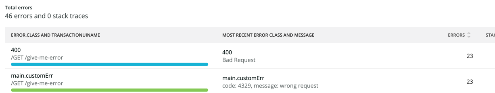
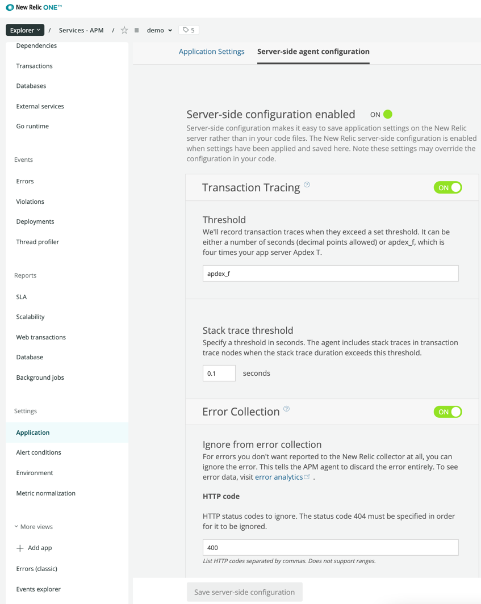
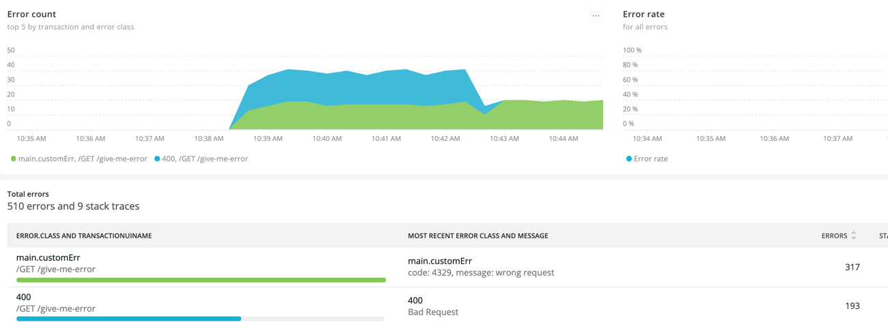

# Noticing Custom Errors

Here is a tip about using custom errors. Let's assume that you are returning `400` status code on `GET /give-me-error`
endpoint, and you are enabled the nrfiber's NoticeError feature. Imagine with the code below.

```go
package main

import (
	"fmt"
	"github.com/erkanzileli/nrfiber"
	"github.com/gofiber/fiber/v2"
	"github.com/newrelic/go-agent/v3/newrelic"
	"log"
	"net/http"
)

type customErr struct {
	Message string `json:"message"`
	Code    int    `json:"code"`
}

func (ce customErr) Error() string {
	return fmt.Sprintf("code: %d, message: %s", ce.Code, ce.Message)
}

func main() {
	app := fiber.New()
	nr, err := newrelic.NewApplication(newrelic.ConfigEnabled(true), newrelic.ConfigAppName("demo"), newrelic.ConfigLicense("license-key"))
	if err != nil {
		log.Fatal(err)
	}
	app.Use(nrfiber.Middleware(nr, nrfiber.ConfigNoticeErrorEnabled(true), nr.ConfigStatusCodeIgnored([]int{401})))
	app.Get("/give-me-error", func(ctx *fiber.Ctx) error {
		err := customErr{Message: "wrong request", Code: 4329}
		ctx.Status(http.StatusBadRequest).JSON(err)
		return err
	})
	app.Listen(":3000")
}
```

You are reporting an error and also returning your consumers a response with status 400 like this.

```shell
$ curl -i localhost:3000/give-me-error
HTTP/1.1 400 Bad Request
Date: Sun, 22 Aug 2021 10:30:14 GMT
Content-Type: application/json
Content-Length: 39

{"message":"wrong request","code":4329}
```

I hope the scenario is clear in your mind now. In that case, you may see a report like this.



This is because NewRelic agent automatically reports all response statuses to the NewRelic. You can ignore them
on `Application Settings / Server-side agent configuration / Error Collection` and use your own error types instead.

Here is an example



Now we won't see duplicate errors. They are disappearing.


